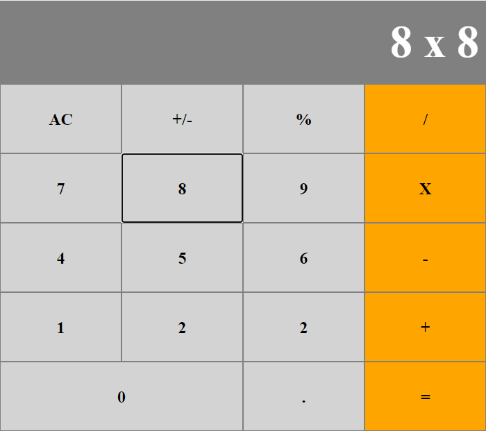

# Calculator - React

This is a calculator program created using React stateful class components and functional components. The state is managed by the parent App component and the logic for the calculator was kept in separate modules.

## Live Demo

[View Live Demo](https://react-calc-seb.herokuapp.com/)

## Screenshot

## Features & Usage

- The basic mathematical operations are included: sum, substraction, multiplication, division.
- Modifier operations are included as well: %, +/-.
- The display can be cleared pressing "AC".
- The display shows the current total, the operation being performed, and the next value to operate.
- Operations with decimals can be performed.
- For accessibility, buttons can be navigated with "tab" and selected with "enter".

## Setup

1. Clone this repository and access the project's directory.
2. Run "npm install".
3. Run "npm start" to work on the development server.
4. Run "npm run build" once the project is ready for production.

## Built With

- JavaScript/ES6
- React
- Heroku

## Author

👤 **Sebastian Gil Rodriguez**

- Github: [@sebGilR](https://github.com/sebGilR)
- Twitter: [@sebGilR](https://twitter.com/sebGilR)
- Linkedin: [sebastiangilrodriguez](https://www.linkedin.com/in/sebastiangilrodriguez)

## 🤝 Contributing

Contributions, issues and feature requests are welcome!

Feel free to check the [issues page](https://github.com/sebGilR/react_calc/issues).

## Show your support

Give a ⭐️ if you like this project!
